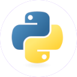
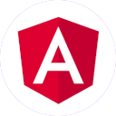

<h1 align="left">
    Hi 👋, I'm Alan J. Santos
</h1>

    A passionate fullstack developer from Brazil

 

<h3>Programming Languages</h3>

 

 

<!-- -->

<h3>Frontend Development</h3>

<!-- -->

 

 

<!-- 

 

<h3>Backend Development</h3>

 

 

 

 

<h3>Mobile App Development</h3>

 

 

 

 

 

<h3>Database</h3>

 

 

 

<h3>Other</h3>

-->

